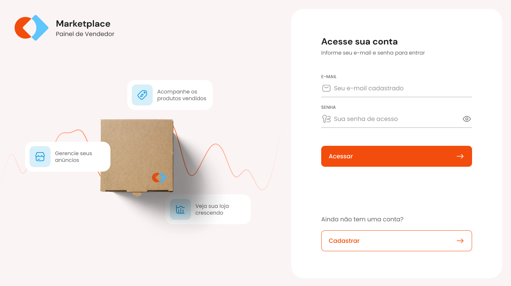

# Rocketseat Marketplace

## How to run

- As the backend we used another project from Rocketseat:
  - https://github.com/rocketseat-education/mba-marketplace-server
  - To start it follow the steps on the README
- To run this project:
  - run `npm i` (i used node 20 and also there is an `.nvmrc`)
  - run `npm run dev`

## Screenshots

  
Login page

  
Dashboard page

  
Products page

## Refs

- [Figma](<https://www.figma.com/design/fV55yqePjTv7MN0C4pqUye/Gest%C3%A3o-de-Marketplace-(Community)?node-id=3-376&t=c3s2mj0gDckGL0Et-1>)

**Some of the tools and dependencies that we worked during this project:**

- [Vite](https://vitejs.dev/guide/): used for a smooth and quick initial project setup
- [Tailwind CSS](https://tailwindcss.com/docs/installation): making css less difficult (still difficult though)
- [UI Shadcn](https://ui.shadcn.com/docs): Beautifully designed components that you can copy and paste into your apps. Accessible. Customizable. Open Source.
- [Sonner](https://sonner.emilkowal.ski/): An opinionated toast component for React
- [Zod](https://zod.dev/): TypeScript-first schema validation with static type inference
- [React Query](https://tanstack.com/query/latest/docs/framework/react/overview): often described as the missing data-fetching library for web applications, but in more technical terms, it makes fetching, caching, synchronizing and updating server state in your web applications a breeze.
