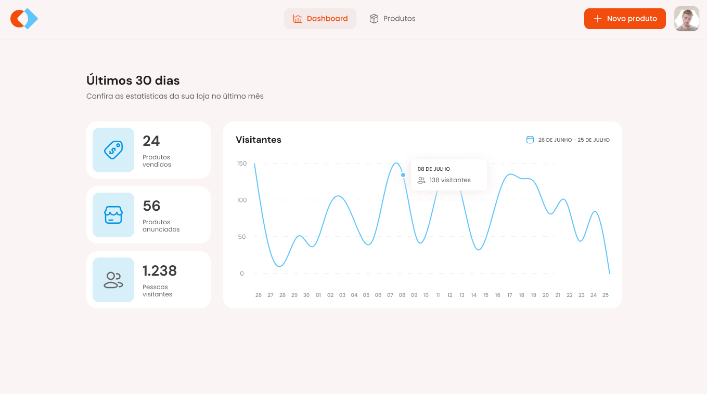
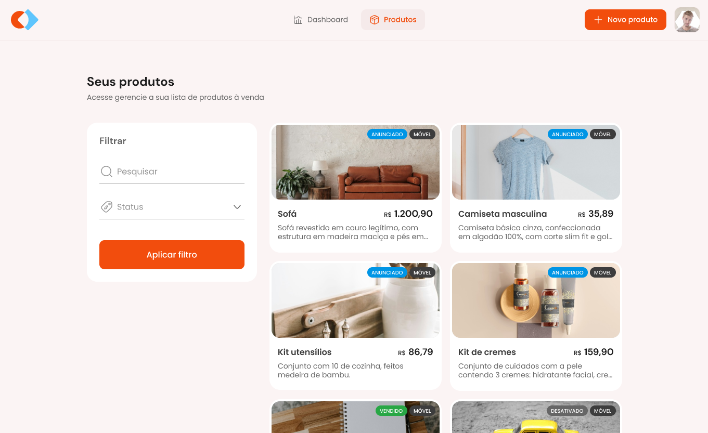

# Rocketseat Marketplace

## How to run

- As the backend we used another project from Rocketseat:
  - https://github.com/rocketseat-education/mba-marketplace-server
  - To start it follow the steps on the README
- To run this project:
  - run `npm i` (i used node 20)
  - run `npm run dev`

## Screenshots

  
Login page

  
Dashboard page

  
Products page

## Refs

- [Figma](<https://www.figma.com/design/fV55yqePjTv7MN0C4pqUye/Gest%C3%A3o-de-Marketplace-(Community)?node-id=3-376&t=c3s2mj0gDckGL0Et-1>)

**On this project we worked with the following tools/dependencies:**

- [Vite](https://vitejs.dev/guide/)
- [Tailwind CSS](https://tailwindcss.com/docs/installation)
- [UI Shadcn](https://ui.shadcn.com/docs)
- [Sonner](https://sonner.emilkowal.ski/)
- [Zod](https://zod.dev/)
- [React Query](https://tanstack.com/query/latest/docs/framework/react/overview)
